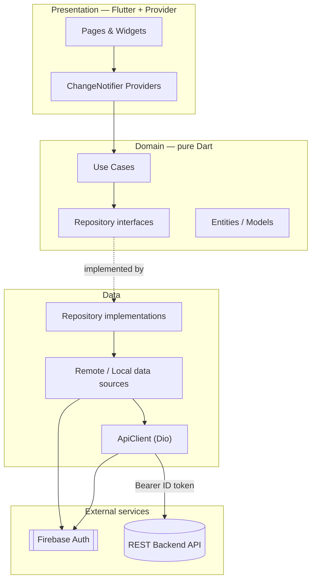

<div align="center">

# Ratatouille 🍳

**A social cooking app for Android that turns the ingredients in your fridge into recipes — and helps reduce food waste.**

[](https://flutter.dev/)
[](https://dart.dev/)
[](https://firebase.google.com/)
[](https://pub.dev/packages/provider)
[](https://pub.dev/packages/dio)
[](https://pub.dev/packages/hive)
[](https://pub.dev/packages/go_router)
[](https://www.android.com/)
[](https://github.com/features/actions)
[](./LICENSE)

</div>

Ratatouille is an Android mobile app that helps people discover, create, and
share home-cooking recipes. Its signature **Fridge Filter** recommends recipes
from whatever ingredients a user already has on hand, so less food goes to waste.
Around that core it adds a small social layer — ratings, comments, and a follow
system — so home cooks can learn from one another. The app was built as a mobile
programming project by students of *Ilmu Komputer, Universitas Sumatera Utara*.

---

## Table of Contents

- [Overview](#overview)
- [Features](#features)
- [Tech Stack](#tech-stack)
  - [Core](#core)
  - [State & Navigation](#state--navigation)
  - [Networking & Auth](#networking--auth)
  - [Storage & Media](#storage--media)
  - [UI & Tooling](#ui--tooling)
- [Architecture](#architecture)
- [Project Structure](#project-structure)
- [Getting Started](#getting-started)
  - [Prerequisites](#prerequisites)
  - [Configuration](#configuration)
  - [Running the App](#running-the-app)
- [Usage](#usage)
- [CI/CD](#cicd)
- [Development Team](#development-team)
- [Design](#design)
- [Backend](#backend)
- [License](#license)

---

## Overview

Deciding what to cook with the few ingredients left in the fridge is a daily
friction — and a common cause of food waste. Ratatouille turns that problem
around: instead of searching by recipe name, a user lists what they *have*, and
the app surfaces recipes they can actually make. Beyond search, anyone can author
their own recipes step by step (with photos), publish them, and engage with the
community through ratings, comments, and follows.

The app is built with a **feature-first, clean-architecture** approach. Each
feature (`users`, `recipes`, `kulkas`) is split into `presentation` → `domain` →
`data` layers, with cross-cutting concerns (networking, DI, routing, theme) kept
in `core`. Business logic lives in framework-independent *use cases*, the UI talks
only to domain abstractions, and a single `ApiClient` interface (implemented with
Dio) is the one place the app reaches the REST backend. Authentication is handled
by Firebase, whose ID token is attached as a bearer token to every backend
request.

## Features

| Feature | Description |
|---|---|
| **🥗 Fridge Filter** | Find recipes by entering only the ingredients you currently have (e.g. *bakso*, oil, green chili) instead of searching by name. |
| **📝 Recipe authoring** | Create recipes through a guided multi-step flow — base info → ingredients → cooking steps → preview — each with image uploads, saved as a draft until published. |
| **👨‍🍳 Social cooking** | Rate recipes (1–5 stars), leave comments, and follow other cooks to keep up with their latest recipes. |
| **📂 Bookmarking** | Save favorite recipes for quick access later. |
| **🔎 Discovery** | Search recipes and search users from dedicated screens. |
| **🔐 Authentication** | Sign up / sign in with email & password or **Google Sign-In**, with email verification and a guided profile-setup step. |
| **👤 Personalized profile** | Manage profile photo, cover, and bio; view your own published recipes and other users' public profiles. |
| **🎨 Themed experience** | A warm, food-inspired Material 3 theme (Playfair Display + Roboto via Google Fonts), edge-to-edge UI, and SVG iconography. |

## Tech Stack

### Core

- **Flutter 3.35** with **Dart SDK ^3.9** — single-codebase Android app, Material 3.
- **Clean architecture, feature-first** — `presentation` / `domain` / `data` layers per feature, shared `core`.
- **get_it 8** — service locator for dependency injection, wired up per feature in `di/` modules.
- **dartz 0.10** — functional error handling (`Either<Failure, T>`) across repositories and use cases.
- **equatable 2** — value equality for models and failures.

### State & Navigation

- **provider 6** — `ChangeNotifier`-based state management; one provider per screen/flow.
- **go_router 16** — declarative routing with auth-aware redirects (refreshes on `AuthProvider`).

### Networking & Auth

- **dio 5** — HTTP client behind a custom `ApiClient` abstraction, with an interceptor that injects the Firebase ID token and content-type headers.
- **firebase_core / firebase_auth 6** — user authentication and ID-token issuance.
- **google_sign_in 6** — Google OAuth sign-in.

### Storage & Media

- **hive / hive_flutter 2** — lightweight local storage (cached user session), with generated type adapters.
- **image_picker 1** — pick recipe and profile images from the gallery/camera.
- **cached_network_image 3** — efficient remote image loading & caching.

### UI & Tooling

- **google_fonts 6** — Playfair Display (headings) + Roboto (body).
- **flutter_svg 2** + **iconify_flutter** — vector icons and navigation glyphs.
- **fluttertoast**, **intl**, **url_launcher**, **android_intent_plus** — toasts, formatting, deep links, and platform intents.
- **json_serializable / json_annotation** + **build_runner** + **hive_generator** — code generation for models and Hive adapters.
- **flutter_launcher_icons** — app-icon generation; **flutter_lints** — linting.

## Architecture

Ratatouille follows a **feature-first, clean-architecture-inspired** structure.
The UI (Provider widgets) depends on **use cases**, which depend on **repository**
abstractions; concrete repositories live in the `data` layer and talk to a remote
data source through the shared `ApiClient`. Firebase issues the auth token that
the Dio interceptor attaches to every call, so authentication concerns never leak
into feature code.



## Project Structure

A high-level view — each feature repeats the same `presentation / domain / data`
layering, with shared concerns in `core`:

```text
ratatouille/
├─ lib/
│  ├─ core/             # Cross-cutting: networking (ApiClient/Dio), DI, routing, theme, constants
│  ├─ features/
│  │  ├─ users/         # Auth, profile, follow system, developer pages
│  │  ├─ recipes/       # Recipe browsing, authoring, detail, comments, ratings, bookmarks
│  │  └─ kulkas/        # Fridge Filter (search recipes by available ingredients)
│  └─ main.dart         # App entry point (Firebase + Hive init, providers, router)
├─ assets/              # images/ and icons/ (SVG)
├─ android/             # Android project & release signing config
├─ test/               # Widget tests
├─ .github/workflows/   # CI/CD (build & release APK)
└─ pubspec.yaml         # Dependencies & asset declarations
```

Within each feature, the layers are:

- **`presentation/`** — pages, widgets, and Provider state holders.
- **`domain/`** — models, repository interfaces, and use cases (no framework dependencies).
- **`data/`** — models/DTOs, data sources, and repository implementations.

## Getting Started

### Prerequisites

- **[Flutter SDK 3.35+](https://docs.flutter.dev/get-started/install)** (Dart `^3.9`).
- **Android Studio** (or the Android SDK + command-line tools) with an emulator or a physical Android device.
- A **[Firebase project](https://console.firebase.google.com/)** with **Email/Password** and **Google** sign-in providers enabled.
- A running instance of the **[Ratatouille backend](https://github.com/andreasmlbngaol/ratatouille-backend)** that the app can point to.

### Configuration

This repository does **not** include Firebase secrets — you must supply your own:

1. **Firebase** — register an Android app in your Firebase project and add the generated config files:
   - `android/app/google-services.json`
   - `lib/firebase_options.dart` (generate with the [FlutterFire CLI](https://firebase.flutter.dev/docs/cli/): `flutterfire configure`)
2. **Backend URL** — point the app at your backend by setting the base URL in
   `lib/core/data/constant/app_constant.dart`:
   ```dart
   class AppConstant {
     static const String baseUrl = "http://<your-backend-host>";
   }
   ```
3. **Release signing (optional)** — for signed release builds, create
   `android/key.properties` and an `upload-keystore.jks` (only needed for release
   builds, not for local development).

### Running the App

```shell
# 1. Clone the repository
git clone https://github.com/andreasmlbngaol/ratatouille.git
cd ratatouille

# 2. Install dependencies
flutter pub get

# 3. Generate code (Hive adapters & JSON serialization)
flutter pub run build_runner build --delete-conflicting-outputs

# 4. Run on a connected device or emulator
flutter run
```

To build a release APK:

```shell
flutter build apk --release
```

## Usage

1. **Sign up or sign in** with email & password or your Google account, then
   verify your email and complete your profile.
2. From the **Home** tab, browse recipes; open any recipe to view ingredients,
   steps, ratings, and comments.
3. Tap **Fridge Filter**, enter the ingredients you have, and get recipes you can
   cook right now.
4. Use **Create Recipe** to author your own — fill in the base info, add
   ingredients and cooking steps with photos, preview, then publish.
5. **Rate**, **comment**, and **follow** other cooks; **bookmark** recipes you
   love and find them again under **Favorites**.
6. Manage your photo, cover, and bio from your **Profile**.

## CI/CD

The project uses **GitHub Actions** (`.github/workflows/deploy.yml`) to automate
builds and releases. On pushes to `main` and on version tags (`v*`), the workflow:

- sets up Java 21, the Android SDK/NDK, and Flutter (stable);
- installs dependencies and runs `build_runner`;
- restores the keystore, `google-services.json`, and `firebase_options.dart` from
  encrypted repository secrets;
- builds a **signed release APK**; and
- publishes it as a **GitHub Release** (tags matching `vX.Y.Z` are full releases,
  other tags are marked pre-release).

## Development Team

Built by students of **Ilmu Komputer, Universitas Sumatera Utara**:

| Member | NIM | Role |
|---|---|---|
| **Andreas Manatar Lumban Gaol** | 221401067 | Project Lead, Fullstack Developer, DevOps |
| **Bintang Aulia** | 231401074 | Versatile Developer / Support, QA |
| **Clara Angelin Pijoh** | 231401086 | Versatile Developer / Support, QA |

## Design

The UI and user flows were designed in **Figma** —
[view the design here](https://www.figma.com/design/wcHvn0haCJ3XZTExpRIQn3/Kotlin-Only-Pemmob?node-id=0-1&t=1lu5nkipXOyB984R-1).

## Backend

Ratatouille talks to a separate REST backend:

- **Backend repository:** [andreasmlbngaol/ratatouille-backend](https://github.com/andreasmlbngaol/ratatouille-backend)
- **Software Requirements Specification (SRS):** [view the SRS](https://drive.google.com/file/d/17hZZag_bpRb61NlA9aHj9jHFR_eRKd21/view?usp=sharing)

## License

This project is licensed under the **MIT License** — see the [LICENSE](./LICENSE)
file for details. It was created as a mobile programming project at the Department
of Ilmu Komputer, Universitas Sumatera Utara. You are welcome to use, study, and
build upon it, provided the original copyright and attribution are preserved.

© 2026 andreasmlbngaol
